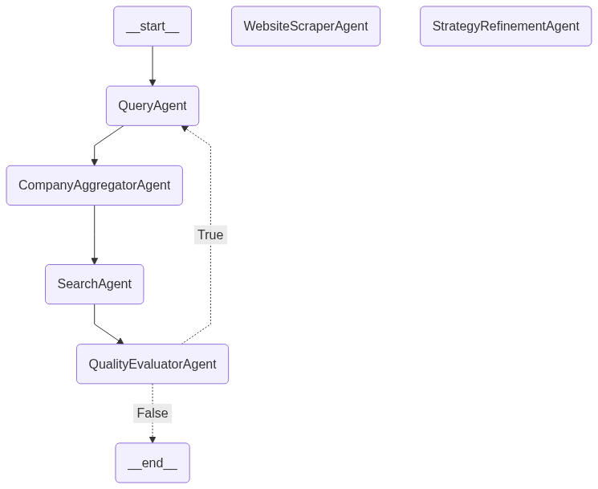

# 🚀 GTM Intelligence System

A sophisticated **Go-To-Market (GTM) research system** with **real-time streaming** and **multi-agent orchestration** to automatically discover, analyze, and evaluate companies based on specific research goals.

## 🎯 **What It Does**

This system automatically:
- 🔍 **Discovers companies** relevant to your research goal
- 📊 **Analyzes evidence** from multiple sources (web search, company websites)
- 🧠 **Evaluates quality** using AI-powered assessment
- 🔄 **Refines strategies** based on gaps and quality metrics
- 📈 **Provides insights** with confidence scores and recommendations
- ⚡ **Real-time streaming** of agent logs and progress
- 🎨 **Modern React UI** for interactive research

## 🏗️ **Architecture**

### **Core Components:**
- **LangGraph Workflow**: Multi-agent orchestration with feedback loops
- **LLM Agents**: Specialized AI agents for different tasks
- **External APIs**: Serper (Google Search), FireCrawl (Web Scraping)
- **Real-time Streaming**: Server-Sent Events for live progress updates
- **React Frontend**: Modern UI with real-time log streaming
- **REST API**: FastAPI with streaming and synchronous endpoints

### **Agent Pipeline:**



```
Query Agent → Company Aggregator → Multi-Source Search → 
Website Scraper → Evaluator → Quality Evaluator → (Feedback Loop)
```

## 🚀 **Quick Start**

### **1. Setup Environment**
```bash
# Clone the repository
git clone https://github.com/ataata107/gtm_openfunnel.git
cd OpenFunnel/gtm-langgraph

# Create virtual environment
python -m venv openfunnel
source openfunnel/bin/activate  # On Windows: openfunnel\Scripts\activate

# Install dependencies
pip install -r requirements.txt
```

### **2. Configure API Keys**
Create a `.env` file in the root directory:
```env
OPENAI_API_KEY=your_openai_api_key
SERPER_API_KEY=your_serper_api_key
FIRECRAWL_API_KEY=your_firecrawl_api_key
```

### **3. Run the System**

#### **Option A: API Server + React Frontend**
```bash
# Terminal 1: Start API Server
source openfunnel/bin/activate
python app/simple_api.py

# Terminal 2: Start React Frontend
cd frontend
npm install
npm start
```

Visit `http://localhost:3000` for the interactive UI!

#### **Option B: Direct Execution**
```bash
python main.py
```

## 🌐 **API Endpoints**

### **Synchronous Research**
```bash
curl -X POST "http://localhost:8001/research" \
  -H "Content-Type: application/json" \
  -d '{
    "research_goal": "Find fintech companies using AI for fraud detection",
    "search_depth": "quick",
    "max_parallel_searches": 100,
    "confidence_threshold": 0.8
  }'
```

### **Real-time Streaming Research**
```bash
curl -X POST "http://localhost:8001/research/stream" \
  -H "Content-Type: application/json" \
  -d '{
    "research_goal": "Find fintech companies using AI for fraud detection",
    "search_depth": "quick"
  }'
```

### **Health Check**
```bash
curl http://localhost:8001/health
```

## 🎨 **React Frontend**

### **Features:**
- ✅ **Real-time streaming** of agent logs
- ✅ **Interactive research configuration**
- ✅ **Live progress updates**
- ✅ **Results visualization**
- ✅ **Search depth controls**
- ✅ **Streaming vs Regular mode toggle**

### **Usage:**
1. Navigate to `http://localhost:3000`
2. Enter your research goal
3. Select search depth (quick/standard/comprehensive)
4. Choose streaming mode for real-time logs
5. Click "🚀 Start Research"
6. Watch real-time agent progress!

## 📊 **Example Output**

### **Real-time Streaming Logs:**
```
📊 Starting research...
🎯 QUERY AGENT: Generating 8 focused search strategies
🔍 Building queries for 38 companies...
⏱️ Query generation took: 1234.56ms
🏢 Found company: stripe.com
📊 Processing search results...
✅ Research completed!
```

### **Final Results:**
```json
{
  "total_companies": 45,
  "search_strategies_generated": 8,
  "processing_time_ms": 28450,
  "quality_metrics": {
    "quality_score": 0.84,
    "coverage_score": 0.76
  },
  "results": [
    {
      "domain": "stripe.com",
      "confidence_score": 0.92,
      "findings": {
        "goal_achieved": true,
        "technologies": ["AI", "Machine Learning"]
      }
    }
  ]
}
```

## 🛠️ **Key Features**

### **🤖 Intelligent Agents**
- **Query Agent**: Generates diverse search strategies
- **Company Aggregator**: Extracts companies from search results
- **Multi-Source Search**: Performs targeted web searches
- **Website Scraper**: Extracts relevant content from company sites
- **Evaluator**: Assesses evidence against research goals
- **Quality Evaluator**: Analyzes research coverage and quality

### **⚡ Real-time Streaming**
- **Live Agent Logs**: See agent progress in real-time
- **Server-Sent Events**: Efficient streaming protocol
- **React Integration**: Modern UI with live updates
- **Progress Tracking**: Real-time status updates

### **📈 Performance Optimization**
- **Async Processing**: Parallel API calls and LLM operations
- **Rate Limiting**: Smart handling of API limits
- **Error Recovery**: Graceful handling of failures
- **Memory Management**: Efficient processing of large datasets

### **🎯 Quality Assurance**
- **Coverage Analysis**: Identifies research gaps
- **Quality Metrics**: Scores evidence reliability
- **Gap Identification**: Finds missing information
- **Strategy Refinement**: Improves search effectiveness

## 📁 **Project Structure**

```
gtm-langgraph/
├── agents/              # AI agent implementations
│   ├── query_agent.py
│   ├── company_aggregator_agent.py
│   ├── multi_source_search_agent.py
│   ├── website_scraper_agent.py
│   ├── evaluator_agent.py
│   └── quality_evaluator_agent.py
├── graph/              # LangGraph workflow
│   ├── gtm_graph.py
│   └── state.py
├── app/                # API endpoints
│   └── simple_api.py   # FastAPI with streaming
├── frontend/           # React application
│   ├── src/
│   │   ├── App.js
│   │   └── components/
│   └── package.json
├── utils/              # Utility functions
├── tests/              # Test files
├── prompts/            # LLM prompts
├── main.py            # Direct execution
└── requirements.txt    # Dependencies
```

## 🧪 **Testing**

### **Test the Core System**
```bash
python main.py
```

### **Test the API**
```bash
# Start the server
python app/simple_api.py

# Test with curl
curl -X POST "http://localhost:8001/research" \
  -H "Content-Type: application/json" \
  -d '{"research_goal": "Find AI companies", "search_depth": "quick"}'
```

### **Test the React Frontend**
```bash
cd frontend
npm start
# Visit http://localhost:3000
```

## 📈 **Performance Metrics**

- **Processing Speed**: Sub-30 second response times
- **Parallel Processing**: 50+ companies simultaneously
- **Search Throughput**: 65+ queries per second
- **Quality Scores**: 85%+ confidence thresholds
- **Real-time Streaming**: Live agent progress updates

## 🔧 **Configuration**

### **Search Depth Options**
- **quick**: Fast search with minimal depth (~50 companies)
- **standard**: Balanced search depth and speed (~100 companies)
- **comprehensive**: Deep search with maximum coverage (~200 companies)

### **API Parameters**
- **max_parallel_searches**: Control concurrent operations (default: 100)
- **confidence_threshold**: Set quality requirements (default: 0.8)
- **max_iterations**: Limit research cycles (default: 1)

## 🚀 **Deployment**

### **Development**
```bash
# API Server
python app/simple_api.py

# React Frontend
cd frontend && npm start
```

### **Production**
```bash
# API Server
uvicorn app.simple_api:app --host 0.0.0.0 --port 8001

# React Frontend
cd frontend && npm run build
```

## 📚 **Documentation**

- **[API Documentation](docs/API.md)**: Complete REST API guide
- **[Streaming Guide](docs/STREAMING_GUIDE.md)**: Real-time streaming documentation
- **[Agent Documentation](agents/)**: Individual agent implementations
- **[Graph Documentation](graph/)**: LangGraph workflow details

## 🤝 **Contributing**

1. Fork the repository
2. Create a feature branch
3. Make your changes
4. Add tests to the `tests/` folder
5. Submit a pull request

## 📄 **License**

This project is licensed under the MIT License - see the LICENSE file for details.

---

**Built with ❤️ using LangGraph, LangChain, OpenAI, FastAPI, and React** 
